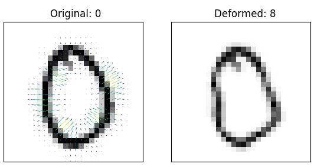

# ADef
This repository contains an implementation of the ADef algorithm for creating adversarial deformations for image classifiers.
Given an image and a classifier, it computes a minimal vector field such that when used to deform the original image, the resulting deformed image is misclassified by the classifier.
The algorithm is described in the paper

*ADef: an Iterative Algorithm to Construct Adversarial Deformations*,  
by Rima Alaifari, Giovanni S. Alberti, and Tandri Gauksson (preprint: https://arxiv.org/abs/1804.07729).

Here is an example image of a zero being deformed into what the classifier believes to be an eight.
The vector field corresponding to the deformation is shown on the original image. 

# Run
**Requirements:** Implemented in PyTorch 0.4.0, using Python 3.6 with numpy, scipy and matplotlib.

Run `python demo_imagenet.py` to get an example of ADef acting on a [pre-trained Inception v3 (or ResNet 101) model](https://pytorch.org/docs/stable/torchvision/models.html).
If not already present, this will download the model's parameters (Inception v3: 104 MB, and ResNet 101: 170 MB).

Run `python train_mnist.py` to quickly train a CNN for MNIST classification (change n_epochs for precision),
and then execute `python demo_mnist.py` to get an example of ADef acting on that model.
This will result in downloading the MNIST database into `resources/` (55 MB).